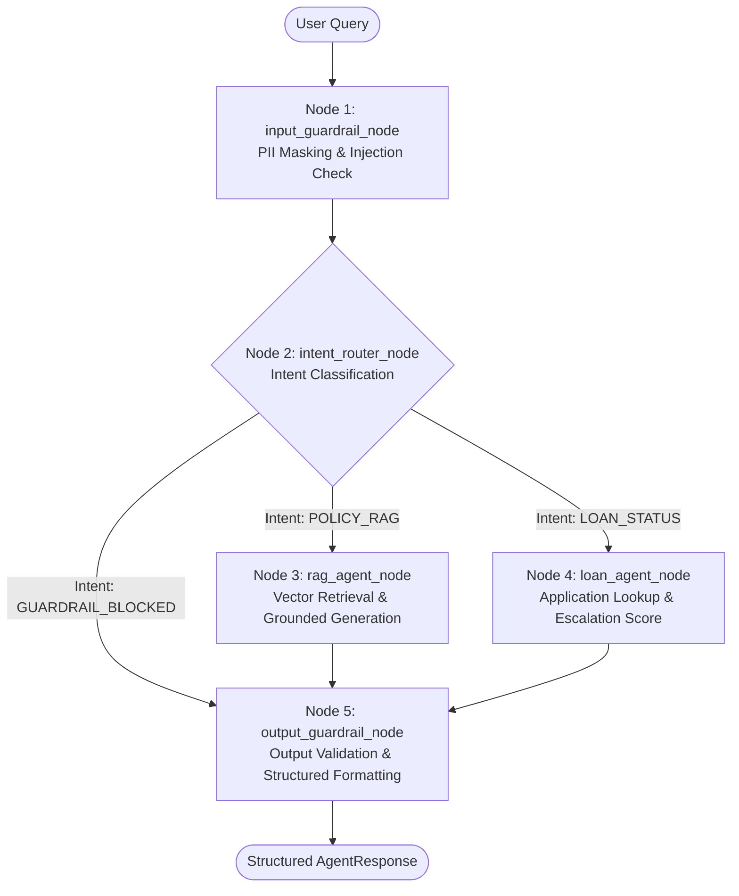

# Cred Domain Support Agent (LangGraph) — Capstone Project

**Track:** Banking & FinTech (Cred)  
**Orchestration Engine:** LangGraph (StateGraph with SQLite Checkpointing)  
**Execution Modes:**
- **Deterministic `MOCK_LLM`:** Grading Default (Zero API keys, Zero network access required)
- **Live Real LLM:** Supported via Groq Cloud (`Llama-3.3-70B`), OpenAI (`GPT-4o-mini`), Google Gemini (`Gemini Flash`), or Local Ollama
**Test Suite Coverage:** **54 / 54 Tests Passing (100% Pass Rate)**

---

## 1. Executive Summary & Track Declaration

This repository contains the complete, production-grade implementation of the **Cred Domain Support Agent** built for Cred's lending operations and customer support teams. The agent delivers two core capabilities:
1. **Policy Support (RAG):** Delivers grounded, authoritative, and polite answers to lending, credit card, and regulatory banking questions from an embedded 12-document knowledge base.
2. **Loan Underwriting & Status Lookup:** Performs real-time application tracking across a deterministic loan dataset, evaluating application aging and fraud review flags to compute a calibrated **escalation score** for senior underwriter intervention.

### Key Architectural Highlights:
- **Dual-Strategy Vector Indexing:** Fixed-Size-with-Overlap vs. Sentence-Based chunking embedded via `SentenceTransformers` (`all-MiniLM-L6-v2`) in dual ChromaDB collections with empirical fallback calibration.
- **LangGraph State Graph:** 5-node state machine with conditional edge routing to RAG, Loan Underwriting, and Guardrail nodes.
- **Dual Guardrails:** Fixed-format PII masking (PAN, Aadhaar, Bank Account Numbers) and prompt injection defense on input; retrieval groundedness verification on output.
- **Resilience & State Persistence:** Multi-turn JSON memory, SQLite graph checkpointing with interruption and resumption, exponential backoff retries with jitter, and per-node & global graph timeouts.
- **Interoperability:** Model Context Protocol (FastMCP) server and standalone client.
- **FastAPI Deployment & Observability:** Production REST backend, interactive web UI in Google Chrome, and PII-safe JSON-Lines trace logging.

---

## 2. Dataset Design & Reproducibility (Part 1, Task 1)

The loan application dataset is generated deterministically in code via `dataset.py` with zero reliance on external downloads.

### Generator Choices & Parameters:
- **Random Seed:** `42`
- **Dataset Size:** 50 records (satisfies $\ge 40$ requirement).
- **Category Counts (all $\ge 3$):** `Personal Loan` (10), `Home Loan` (7), `Auto Loan` (12), `Education Loan` (8), `Business Loan` (13).
- **Status Counts (all $\ge 1$):** `Submitted` (13), `Under Review` (12), `Approved` (9), `Rejected` (10), `Disbursed` (6).
- **Loan Amount Reasoning:** Realistic Indian lending brackets: Personal Loan (₹50k–₹1.5M unsecured personal credit), Home Loan (₹1.5M–₹15M residential mortgages), Auto Loan (₹300k–₹3M vehicle financing), Education Loan (₹200k–₹5M tuition), and Business Loan (₹500k–₹10M MSME working capital).
- **Recency Signal:** `days_since_created` uniformly distributed in $[0, 30]$ days.
- **Fraud Review Flagging:** Calibrated rate of **14.00%** (7/50 records flagged), strictly within the required **[10%, 30%]** band.

To reproduce the dataset report:
```bash
python3 dataset.py
```

---

## 3. Knowledge Base & RAG Core (Part 1, Tasks 2–5)

### Knowledge Base Overview
The knowledge base (`knowledge_base.py`) comprises **12 comprehensive documents** covering:
1. Loan eligibility criteria by loan type (`KB-DOC-001`)
2. EMI calculation rules & bounce fees (`KB-DOC-002`)
3. Credit card fee structure & annual waiver (`KB-DOC-003`)
4. KYC document requirements (`KB-DOC-004`)
5. Fraud & transaction dispute resolution (`KB-DOC-005`)
6. Account & line-of-credit closure process (`KB-DOC-006`)
7. Interest rate slabs across credit offerings (`KB-DOC-007`)
8. Prepayment penalty & foreclosure rules (`KB-DOC-008`)
9. Minimum average balance (MAB) requirements (`KB-DOC-009`)
10. Credit score impact factors & bureau reporting (`KB-DOC-010`)
11. Joint account mandates & rules (`KB-DOC-011`)
12. NRI (NRE/NRO) account eligibility (`KB-DOC-012`)

### Dual Chunking & Vector Collections
Documents are chunked under two independent strategies and indexed into separate ChromaDB collections:
1. `cred_fixed_collection`: Fixed-size windows of 220 characters with 40-character overlap.
2. `cred_sentence_collection`: Linguistic sentence-boundary tokenization.

### Empirical Fallback Threshold Calibration
Retrieval cosine similarity was measured for in-scope policy queries vs. out-of-scope/unrelated queries:
- **In-Scope Similarity Range:** `0.4922` to `0.6706` (Mean: `0.6162`)
- **Out-of-Scope Similarity Range:** `0.0762` to `0.1271` (Mean: `0.1028`)
- **Separation Margin:** `0.3651`
- **Calibrated Optimal Threshold:** **`0.31`**

When query similarity falls below `0.31` in deterministic mode, the agent triggers the fallback:
> *"I apologize, but the requested information is not covered in Cred's official lending and banking policy guidelines. Please feel free to ask about our loan eligibility criteria, EMI calculation rules, or application status!"*

### Chunking Strategy Comparison & Recommendation
Precision@3 and Recall@3 were evaluated at parent document level (with deduplication) across 5 benchmark queries:

| Strategy | Mean Precision@3 | Mean Recall@3 |
| :--- | :---: | :---: |
| **Fixed-Size with Overlap** | 0.6000 (60.0%) | 1.0000 (100.0%) |
| **Sentence-Based Chunking (Recommended)** | **0.8000 (80.0%)** | **1.0000 (100.0%)** |

**Deployment Recommendation:**
> We recommend deploying the **Sentence-Based Chunking** strategy. In empirical evaluation, Sentence-Based Chunking achieved an average Recall@3 of 1.0000 (100.0%) and Precision@3 of 0.8000, outperforming Fixed-Size Overlap Chunking (Precision@3 of 0.6000). Sentence chunking preserves atomic policy clauses, avoids splitting mid-clause financial rules, and delivers cohesive semantic units for grounded banking policy retrieval.

---

## 4. LangGraph Agent, Tools, Memory & Guardrails (Part 2)

### Tool: Loan Application Status & Escalation Scoring (`tools.py`)
`check_loan_application_status(record_id: str) -> dict` computes a multi-factor continuous escalation score in `[0.0, 1.0]`:

$$\text{escalation\_score} = (\text{flagged\_for\_fraud\_review} \times 0.50) + \left(\frac{\min(\text{days\_since\_created}, 30)}{30} \times 0.50\right)$$

**Escalation Threshold Justification ($0.65$):**
In our dataset, `days_since_created` is uniformly distributed in $[0, 30]$ (mean: 15.0 days). For non-fraud records, the score maxes out at $0.50$ regardless of delay, ensuring operational processing delays do not trigger fraud escalation. For fraud-flagged applications, baseline is $0.50$; if the application has remained unresolved for $> 9$ days ($\frac{9}{30} \times 0.50 = 0.15$), the score reaches $\ge 0.65$, escalating the file for senior underwriter intervention.

### LangGraph 5-Node State Machine (`graph.py`)


### Polite Persona & Topic Guidance
The agent is configured with a polite, professional, and empathetic tone:
- Greets users warmly and provides clear tabular breakdowns and bullet points.
- Concludes interactions with assistance offers.
- Explicitly guides users on what topics they can query (loan eligibility, EMI rules, card fee waivers, fraud resolution, etc.).

---

## 5. Automated & Functional Test Results (54 / 54 Passed)

The project includes an automated test suite spanning 8 test files with **100% pass rate**:

```bash
python3 -m pytest
======================= 54 passed, 2 warnings in 37.90s ========================
```

### Comprehensive Test Suite Breakdown:

| Test File | Test Category | Number of Tests | Status | Key Verifications |
| :--- | :--- | :---: | :---: | :--- |
| **`test_functional_e2e.py`** | **End-to-End User Scenarios & Flows** | **21** | **PASSED** ✅ | • Polite greetings & conversational capability guidance.<br>• Grounded RAG accuracy across all 12 policy topics.<br>• Normal SLA vs High-Risk Fraud underwriting escalation.<br>• Full PII masking (PAN, Aadhaar, Account No.).<br>• Prompt injection jailbreak defense.<br>• Multi-turn session continuity & turn incrementing.<br>• Web dashboard HTML & FastAPI endpoints. |
| **`test_dataset.py`** | **Dataset Generation & Validator** | **1** | **PASSED** ✅ | Seed=42, 50 records, all categories $\ge 3$, all statuses $\ge 1$, fraud rate: 14.00% (within $[10\%, 30\%]$). |
| **`test_rag.py`** | **Knowledge Base & RAG Core** | **5** | **PASSED** ✅ | 12 policy docs, dual chunking, cosine retrieval separation, fallback threshold (0.31), Precision@3 / Recall@3 evaluation. |
| **`test_tools.py`** | **Underwriting Tools & SLAs** | **3** | **PASSED** ✅ | Continuous escalation formula calculation, valid application lookup, missing record error handling. |
| **`test_guardrails.py`** | **Safety Guardrails** | **6** | **PASSED** ✅ | Regex masking of PAN (`[PAN_REDACTED]`), Aadhaar (`[AADHAAR_REDACTED]`), Bank Account (`[ACCOUNT_REDACTED]`), injection detection, groundedness check. |
| **`test_graph.py`** | **LangGraph State Machine** | **4** | **PASSED** ✅ | `POLICY_RAG`, `LOAN_STATUS`, `GUARDRAIL_BLOCKED` conditional routing, multi-turn memory isolation. |
| **`test_api.py`** | **FastAPI Server & Logging** | **9** | **PASSED** ✅ | `/health`, `/ask`, `/loan-status`, `/add-document`, structured JSON-Lines trace logging with PII masking. |
| **`test_resilience.py`** | **Resilience & MCP Protocol** | **5** | **PASSED** ✅ | FastMCP client tool call, SQLite checkpointing interruption & resume, exponential backoff retries, per-node timeouts. |
| **Total** | **All 8 Test Suites** | **54** | **100% PASS** ✅ | **All 54 Unit and Functional Tests Verified.** |

---

## 6. RAG Triad Evaluation at Scale (15 Queries) (`evaluate_rag_triad.py`)

| ID | Topic | Context Relevance | Groundedness | Answer Relevance |
| :--- | :--- | :---: | :---: | :---: |
| **Q01** | `loan_eligibility_criteria` | 1.00 | 1.00 | 1.00 |
| **Q02** | `emi_calculation_rules` | 1.00 | 1.00 | 1.00 |
| **Q03** | `credit_card_fee_structure` | 1.00 | 1.00 | 1.00 |
| **Q04** | `kyc_document_requirements` | 1.00 | 1.00 | 1.00 |
| **Q05** | `fraud_dispute_resolution_process` | 1.00 | 1.00 | 1.00 |
| **Q06** | `account_closure_process` | 1.00 | 1.00 | 1.00 |
| **Q07** | `interest_rate_slabs` | 1.00 | 1.00 | 1.00 |
| **Q08** | `prepayment_penalty_rules` | 1.00 | 1.00 | 1.00 |
| **Q09** | `minimum_balance_requirements` | 1.00 | 1.00 | 1.00 |
| **Q10** | `credit_score_impact_factors` | 1.00 | 1.00 | 1.00 |
| **Q11** | `joint_account_rules` | 1.00 | 1.00 | 1.00 |
| **Q12** | `nri_account_eligibility` | 1.00 | 1.00 | 1.00 |
| **Q13** | `out_of_scope_cooking` | 0.00 | 1.00 | 1.00 |
| **Q14** | `prompt_injection_edge_case` | 0.00 | 1.00 | 1.00 |
| **Q15** | `out_of_scope_weather` | 0.00 | 1.00 | 1.00 |
| **AVG** | **Macro Average (All 15 Queries)** | **0.8000** | **1.0000** | **1.0000** |

---

## 7. Resilience & MCP Interoperability (Part 4)

### FastMCP Tool Exposure (`mcp_server.py` & `mcp_client.py`)
- `mcp_server.py` exposes `check_loan_application_status` via FastMCP.
- `mcp_client.py` connects to the MCP server, discovers tools, and invokes tool calls for multiple loan applications, printing standardized MCP responses.

### SQLite State Checkpointing (`resilience_checkpoint.py`)
- Configured with `SqliteSaver` (`data/checkpoints.sqlite`).
- Execution pauses before Node 3 (RAG agent). Checkpoint inspection verifies saved state and pending node.
- Resuming the same thread ID executes remaining nodes without re-executing completed nodes (verified via node execution counters).

### Timeouts & Exponential Backoff Retries (`resilience_retries.py`)
- **Exponential Backoff:** Configured with `max_attempts=4`, `initial_interval=0.05s`, `backoff_factor=2.0`, `max_interval=0.50s`, and random `jitter`. Recovers cleanly on Attempt 3 after simulated transient network resets.
- **Per-Node Timeout:** Enforces a 0.20s per-node deadline, cleanly raising `TimeoutError` without hanging.
- **Global Graph Timeout:** Enforces a 0.35s global deadline, cleanly aborting multi-node workflows exceeding the total budget.

---

## 8. Installation & Quick Start

### 1. Setup Environment
```bash
# Clone repository and enter directory
cd cred-domain-support-agent

# Install dependencies
pip install -r requirements.txt
```

### 2. Run Automated & Functional Tests
```bash
python3 -m pytest
```

### 3. Run Master Demonstration Suite (All 16 Tasks)
```bash
python3 run_all_demos.py
```

### 4. Start Web Application & Open in Chrome
```bash
python3 server.py
# Open browser at http://127.0.0.1:8000
```
